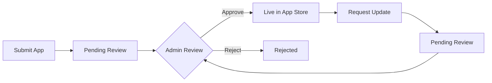

# Publishing Your Mini App

Learn how to publish your mini app to the Movement App Store.

::: tip QUICK PUBLISH
**Want to publish without code?** Use our [**App Publisher Dashboard →**](/publishing/publisher)

Connect your wallet and submit your app through our easy-to-use web interface. No SDK or coding required!
:::

## Overview

The Movement App Store uses an on-chain registry to manage mini apps. All submissions, approvals, and updates are recorded on the Movement blockchain, ensuring transparency and immutability.

## Publishing Flow



## Quick Start

1. **Prepare your app** - Test thoroughly in developer mode
2. **Submit to registry** - Call the smart contract submission function
3. **Wait for approval** - Admins review within 24-48 hours
4. **Go live** - Approved apps appear automatically in the app store

## App Metadata

When submitting your app, you'll provide the following metadata:

| Field | Type | Description | Example |
|-------|------|-------------|---------|
| `name` | String | App name (max 50 chars) | `"DeFi Dashboard"` |
| `description` | String | Brief description (max 200 chars) | `"Track your DeFi portfolio"` |
| `icon` | String | Icon URL (HTTPS .png or .jpg) | `"https://yourdomain.com/icon.png"` |
| `url` | String | App URL (HTTPS required) | `"https://app.example.com"` |
| `slug` | String | URL-friendly identifier (lowercase, numbers, hyphens) | `"my-rewards-app"` |
| `developer_name` | String | Your name or organization | `"Acme Labs"` |
| `category` | String | App category | `"earn"` |
| `permissions` | Array&lt;String&gt; | Requested permissions | `["wallet_read", "sign_transaction"]` |

### Categories

Choose one category for your app:

- `games` - Games and entertainment
- `earn` - Earning opportunities and rewards
- `social` - Social and communication apps
- `collect` - Collectibles and digital assets
- `swap` - Token swaps and exchanges
- `utility` - Productivity and utility tools
- `other` - Other (specify your own category, max 24 characters)

### Permissions

Declare all permissions your app needs:

| Permission | Description | Use Case |
|------------|-------------|----------|
| `wallet_read` | Read wallet address and balance | Display user's address |
| `sign_transaction` | Request transaction signatures | Submit on-chain transactions |
| `sign_message` | Request message signatures | Authentication |
| `storage_read` | Read local storage | Load user preferences |
| `storage_write` | Write to local storage | Save user settings |
| `camera` | Access device camera | QR code scanning |
| `location` | Access device location | Location-based features |

## Submission Requirements

Before submitting, ensure your app meets these requirements:

### ✅ Technical Requirements

- [ ] **HTTPS Required** - App must be served over HTTPS
- [ ] **Mobile Responsive** - Works on all mobile screen sizes
- [ ] **Fast Loading** - Loads in &lt; 3 seconds
- [ ] **SDK Integration** - Uses Movement SDK correctly
- [ ] **Error Handling** - Handles all error states gracefully
- [ ] **No External Auth** - Uses wallet authentication only

### ✅ Content Requirements

- [ ] **Clear Purpose** - App purpose is immediately clear
- [ ] **User-Friendly** - Intuitive interface and navigation
- [ ] **Complete** - All features are functional (no "coming soon")
- [ ] **Professional** - High-quality UI and branding
- [ ] **Original** - Not a copy of existing app

### ✅ Security Requirements

- [ ] **Permission Scoping** - Only request necessary permissions
- [ ] **No Malicious Code** - No phishing, scams, or exploits
- [ ] **Data Privacy** - Complies with data protection standards
- [ ] **Open Source** (Recommended) - Source code publicly available

### 💰 Submission Fee

A **1 MOVE** submission fee is required to submit your app for review. This one-time fee:

- Prevents spam submissions
- Ensures serious developers
- Helps maintain registry quality
- Is non-refundable

Make sure your wallet has at least **1 MOVE + gas fees** before submitting.

## Submission Process

### 1. Test Your App

Test thoroughly in developer mode:

```typescript
// Enable developer mode in Movement app
// Settings → Developer Options → Developer Mode

// Enter your app URL in Mini App Testing
// Test all features and edge cases
```

### 2. Deploy to Production

Deploy your app to a production URL:

```bash
# Build for production
npm run build

# Deploy to your hosting provider
# Vercel, Netlify, Cloudflare Pages, etc.
```

Ensure your URL:
- Uses HTTPS
- Is publicly accessible
- Has a valid SSL certificate
- Has CORS configured (if using APIs)

### 3. Submit to Registry

Submit your app using one of these methods:

#### Option A: Web Dashboard (Recommended)

Use our [**App Publisher Dashboard**](/publishing/publisher) for a simple, code-free submission:

1. Visit [Publisher Dashboard](/publishing/publisher)
2. Connect your wallet
3. Fill in your app details
4. Click "Submit App for Review"

#### Option B: Smart Contract (Advanced)

Submit your app by calling the smart contract directly:

::: code-group

```typescript [TypeScript/SDK]
import { Aptos, AptosConfig, Network } from '@aptos-labs/ts-sdk';

// Testnet registry address
const REGISTRY_ADDRESS = '0xba8a509e05730d3025d6d63e4974cf3296f7af78b6bb9c1e26d9e7d0fc1d8d63';

async function submitApp() {
  const aptos = new Aptos(new AptosConfig({
    network: Network.CUSTOM,
    fullnode: 'https://testnet.movementnetwork.xyz/v1'
  }));

  const transaction = await aptos.transaction.build.simple({
    sender: yourAddress,
    data: {
      function: `${REGISTRY_ADDRESS}::app_registry::submit_app`,
      functionArguments: [
        "My Rewards App",           // name
        "Track your rewards and earnings", // description
        "https://yourdomain.com/icon.png", // icon (.png or .jpg over HTTPS)
        "https://myapp.com",        // url
        "my-rewards-app",           // slug (URL-friendly identifier)
        "Acme Labs",                // developer_name
        "earn",                     // category
        ["wallet_read", "sign_transaction"] // permissions
      ],
    },
  });

  const response = await aptos.signAndSubmitTransaction({
    signer: account,
    transaction,
  });

  await aptos.waitForTransaction({ transactionHash: response.hash });

  console.log('App submitted! Transaction:', response.hash);
}
```

```bash [Aptos CLI]
aptos move run \
  --function-id '@app_registry::app_registry::submit_app' \
  --args \
    string:"My Rewards App" \
    string:"Track your rewards and earnings" \
    string:"https://yourdomain.com/icon.png" \  # .png or .jpg
    string:"https://myapp.com" \
    string:"my-rewards-app" \
    string:"Acme Labs" \
    string:"earn" \
    'vector&lt;string&gt;:["wallet_read","sign_transaction"]'
```

:::

### 4. Track Submission Status

Check your submission status:

```typescript
// Get app by app_index (returned when you submit)
const app = await aptos.view({
  payload: {
    function: `${REGISTRY_ADDRESS}::app_registry::get_app`,
    functionArguments: [appIndex], // u64 app_index
  },
});

console.log('Status:', app.status); // 0=Pending, 1=Approved, 2=Rejected

// Or get app by slug (for approved apps only)
const appBySlug = await aptos.view({
  payload: {
    function: `${REGISTRY_ADDRESS}::app_registry::get_app_by_slug`,
    functionArguments: ["my-rewards-app"], // slug string
  },
});
```

Status codes:
- `0` - **Pending** - Awaiting admin review
- `1` - **Approved** - Live in app store
- `2` - **Rejected** - See rejection reason

### 5. Go Live

Once approved:
- ✅ App appears in Movement App Store automatically
- ✅ Users can discover and launch your app
- ✅ App is marked as "verified" with badge
- ✅ You can submit updates

## Updating Your App

### Update Process

1. **Deploy new version** to your URL
2. **Request update approval** via smart contract
3. **Wait for admin approval**
4. **Update goes live** automatically

### Submit Update Request

You can request updates via the [**Publisher Dashboard**](/publishing/publisher) or using the smart contract:

```typescript
async function requestUpdate(appIndex: number) {
  const transaction = await aptos.transaction.build.simple({
    sender: yourAddress,
    data: {
      function: `${REGISTRY_ADDRESS}::app_registry::request_update`,
      functionArguments: [
        appIndex,                      // u64 app_index
        "My Rewards App v2",           // updated name
        "New features and improvements", // updated description
        "https://yourdomain.com/icon.png", // icon (.png or .jpg over HTTPS)
        "https://myapp.com",            // url
        "earn",                         // category
        ["wallet_read", "sign_transaction", "storage_write"] // updated permissions
      ],
    },
  });

  await aptos.signAndSubmitTransaction({ signer: account, transaction });
}
```

::: warning PENDING UPDATES
You can only have **one pending update** at a time. Wait for approval before submitting another update.
:::

### Check Pending Updates

```typescript
const hasPending = await aptos.view({
  payload: {
    function: `${REGISTRY_ADDRESS}::app_registry::has_pending_change`,
    functionArguments: [appIndex], // u64 app_index
  },
});

if (hasPending) {
  const pendingChange = await aptos.view({
    payload: {
      function: `${REGISTRY_ADDRESS}::app_registry::get_pending_change`,
      functionArguments: [appIndex], // u64 app_index
    },
  });

  console.log('Pending update:', pendingChange);
}
```

## Review Process

### Timeline

- **Initial Review**: 24-48 hours
- **Update Reviews**: 12-24 hours
- **Resubmissions**: 24-48 hours

### Review Criteria

Admins evaluate apps based on:

1. **Functionality** - Does the app work as described?
2. **User Experience** - Is it intuitive and polished?
3. **Security** - Are permissions appropriate? Any security concerns?
4. **Quality** - Professional design and implementation?
5. **Value** - Does it provide value to users?
6. **Compliance** - Follows all guidelines and requirements?

### Common Rejection Reasons

- **Broken functionality** - App crashes or doesn't work
- **Poor UX** - Confusing navigation or broken layouts
- **Excessive permissions** - Requests more permissions than needed
- **Security concerns** - Potential malicious code or vulnerabilities
- **Incomplete** - Missing features or "coming soon" placeholders
- **Low quality** - Unprofessional design or bugs
- **Duplicate** - Too similar to existing app
- **Inappropriate content** - Violates content policy

### After Rejection

If your app is rejected:

1. Read the rejection reason carefully
2. Fix the issues
3. Resubmit using the same process
4. Address feedback in submission notes

## Removing Your App

You can remove your app at any time:

```typescript
async function removeApp(appIndex: number) {
  const transaction = await aptos.transaction.build.simple({
    sender: yourAddress,
    data: {
      function: `${REGISTRY_ADDRESS}::app_registry::remove_app`,
      functionArguments: [
        appIndex, // u64 app_index
      ],
    },
  });

  await aptos.signAndSubmitTransaction({ signer: account, transaction });
}
```

::: warning PERMANENT REMOVAL
Removing your app is permanent. Users will no longer be able to access it from the app store.
:::

## Stats and Analytics

### View Your Stats

```typescript
// Get app by app_index
const app = await aptos.view({
  payload: {
    function: `${REGISTRY_ADDRESS}::app_registry::get_app`,
    functionArguments: [appIndex], // u64 app_index
  },
});

console.log('Downloads:', app.downloads);
console.log('Rating:', app.rating / 10); // Stored as rating * 10

// Or get all your apps as a developer
const [appIndices, apps] = await aptos.view({
  payload: {
    function: `${REGISTRY_ADDRESS}::app_registry::get_developer_apps`,
    functionArguments: [yourAddress], // developer address
  },
});
```

Stats tracked:
- **Downloads** - Number of users who launched your app
- **Rating** - Average user rating (0-5 stars)
- **Verified Badge** - Approved apps get verified badge

::: tip STATS UPDATES
Stats are updated by admins periodically. Check back regularly to see your app's performance.
:::

## Smart Contract Reference

### Registry Address

The app registry contract uses a named address `@app_registry` internally. When calling functions, you can use either the named address or the actual address:

::: code-group

```typescript [Mainnet]
const REGISTRY_ADDRESS = '0x...'; // Coming soon - mainnet not deployed yet
```

```typescript [Testnet]
const REGISTRY_ADDRESS = '0xba8a509e05730d3025d6d63e4974cf3296f7af78b6bb9c1e26d9e7d0fc1d8d63';
// Or use the named address: '@app_registry'
```

:::

::: tip NAMED ADDRESS
The contract uses the named address `@app_registry` internally. You don't need to pass `registry_address` as a parameter to any function - the contract automatically uses `@app_registry`.
:::

### Entry Functions

| Function | Description | Parameters | Who Can Call |
|----------|-------------|------------|--------------|
| `submit_app` | Submit new app | `name, description, icon, url, slug, developer_name, category, permissions` | Any developer |
| `request_update` | Request app update | `app_index, name, description, icon, url, category, permissions` | App owner |
| `remove_app` | Remove your app | `app_index` | App owner |

### View Functions

| Function | Description | Parameters | Returns |
|----------|-------------|------------|---------|
| `get_app` | Get app metadata by index | `app_index: u64` | `AppMetadata` |
| `get_app_by_slug` | Get approved app by slug | `slug: String` | `AppMetadata` |
| `get_developer_apps` | Get all apps by developer | `developer_address: address` | `(vector<u64>, vector<AppMetadata>)` |
| `get_all_active_apps` | Get all approved apps | None | `vector<AppMetadata>` |
| `app_exists` | Check if app exists | `app_index: u64` | `bool` |
| `get_stats` | Get registry stats | None | `(total, approved, pending)` |
| `has_pending_change` | Check for pending update | `app_index: u64` | `bool` |
| `get_pending_change` | Get pending update | `app_index: u64` | `PendingChange` |
| `get_submit_fee` | Get submission fee in octas | None | `u64` |
| `get_treasury_address` | Get treasury address | None | `address` |

### Admin Functions

These functions are restricted to registry admins:

- `approve_app` - Approve pending submission
- `reject_app` - Reject pending submission
- `approve_update` - Approve pending update
- `update_stats` - Update app downloads/rating
- `update_submit_fee` - Update submission fee
- `update_treasury_address` - Update treasury address
- `add_owner` - Add new admin
- `remove_owner` - Remove admin

## Events

The registry emits events for all state changes:

```typescript
// Listen for events
aptos.getEvents({
  address: REGISTRY_ADDRESS,
  eventType: `${REGISTRY_ADDRESS}::app_registry::AppSubmittedEvent`,
});
```

Event types:
- `AppSubmittedEvent` - New app submitted
- `AppApprovedEvent` - App approved
- `AppRejectedEvent` - App rejected
- `AppUpdateRequestedEvent` - Update requested
- `AppRemovedEvent` - App removed

## Best Practices

### Development

- ✅ **Test thoroughly** - Test all features before submitting
- ✅ **Handle errors** - Show user-friendly error messages
- ✅ **Loading states** - Show loading indicators
- ✅ **Mobile-first** - Design for mobile screens
- ✅ **Performance** - Optimize images and bundle size

### Submission

- ✅ **Clear description** - Explain what your app does
- ✅ **Appropriate category** - Choose the right category
- ✅ **Minimal permissions** - Only request what you need
- ✅ **Professional icon** - Use a clear, recognizable icon URL over HTTPS (.png or .jpg)
- ✅ **Stable URL** - Don't change your app URL after approval

### Updates

- ✅ **Version changes carefully** - Test before requesting update
- ✅ **Communicate changes** - Update description with new features
- ✅ **Maintain compatibility** - Don't break existing functionality
- ✅ **Monitor stats** - Track downloads and ratings

## Support

Need help publishing your app?

- **Documentation** - Read the full [Mini App Docs](/quick-start/)
- **Discord** - Join the Movement Discord
- **GitHub** - Report issues on GitHub
- **Admin Contact** - Email support@movement.xyz

## Next Steps

- **[Testing →](/quick-start/testing)** - Test your app in developer mode
- **[Design Guidelines →](/guidelines/design)** - Polish your UI
- **Smart Contract** - View the [registry contract source](https://github.com/movement-labs/...)
